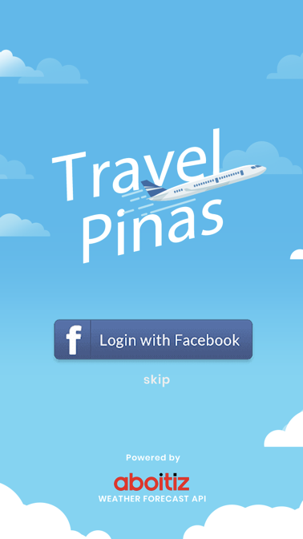

## TravelPinas

**Team Name:** Digify

**Challenge:** Travel and Tourism

**Short Description:** TravelPinas: A mobile application for gamified-immersive travel experience in the Philippines.

**Long Description:**  
With an all-time high of 6.6 million visiting tourists + comparable number of Filipino backpackers in the country, TravelPinas mobile app is your companion tool for you to travel with great experience. 

The Augmented Reality (AR) and Virtual Environments (VE) immersive experience powered by Aboitiz Weather Forecast API can make travel more convenient, seamless, and secure. 

The customizable suggested itinerary easily records your adventure plan such as booking options to airport, seaport, road and railways transportations; hotels; restaurants; and fun things to do.

The gamified location-based marketing tool built-in the app, such as getting 'Rainy Season' and 'Hot Summer' deals, discounts and promos; and earning points and gifts together with your families and friends will really make your travel experience in the Philippines more fun, engaging and exciting.

Make travel blogging and/or vlogging a pleasure. Again, you can earn points and gifts when you share your travel plans and experiences to the communities and social media.

It's definitely more fun in the Philippines using TravelPinas mobile app.

**Screenshots:**

#### 1. Login / Splash Screen

#### 2. Feeds Screen
Shows 5 categories of feed contents: 
- transportation options, booking promo, deals and discounts (such as: airlines, seaport, land travel)
- hotels and places to stay options, booking promo, deals and discounts
- foods & restaurants	options, promo, deals and discounts
- attractions options and packages, promo, deals and discounts
- family, relatives, and friends shared travel plans, travel invitations and travel experience

#### 3. TravelPinas App Menu Screen

- displays summary of user earned points and gifts
- menu button items for navigating other screens of the app

#### 4. Profile Screen

Contains minimal user info and an optional Union bank account info.

#### 5. My Gifts Screen

Displays the list of gifts collected by the during his/her travel.

#### 6. Attraction (Info) Screen

On top shows the 360 degree video of the attraction or festival so that the user could have a closer look or visually experience what to expect if he/she decided to travel to that place.
- information about the selected tourist attraction or festival  and events
- deals and promotions
- statistics, ratings and recommendation from other visitors who have been in the place
- weather info about this attraction or festival

#### 7. Attraction (Info) Thumbnail Images Gallery Screen

Shows some more videos and images about the attraction or festival.

#### 8. Attraction (Info) Large View Images Gallery Screen

#### 9. Attraction (Deals and Promos) Screen

#### 10. Attraction (Statistics and Ratings) Screen

#### 11. Attraction (Weather Forecast) Screen

#### 12. Add / Create Travel Plan Screen

Create a schedule of your travel plan.

#### 13. Modify Suggested Travel Plan's Daily Itenarary Screen

After creating a travel plan, there is a default daily itinerary suggestions that you could customize.

#### 14. Add Travel Plan's Itenarary Screen

Customizable daily itineraries to maximize your travel activities.

#### 15. Travel Plan's Itenarary Info Screen

#### 16. Travel Check In (Welcome) Screen

Now, when you already started your travel and arrived at the target place or attraction, you tap the checkin button and the virtual agent, via augmented experience, will verify if your ready to go.

#### 17. Travel Map Screen

While enjoying your tour, you can also start your gamified location-based hunting of points and gifts.

#### 18. Points and Gifts Dialog Screen

Collect as many points and gifts as you want.

#### 19. List of Travel Plans Screen

List of your saved travel plans.

#### 20. Travel History Screen

List of your travel experiences.

#### 21. Settings Screen

Manage notifications and which SNS accounts you want to link in the app.

#### 22. Privacy Policy Screen

Let the user understand how the app use the information they provided, why the app collects those data and your disclosure aggreement.

#### 23. Travel Gallery (Thumbnail Images) Screen

Displays your photos and videos of your travel.

#### 24. Travel Gallery (Large View Images, SNS Sharing) Screen

Share your photos and videos, blog about your travel experience to earn more points.

